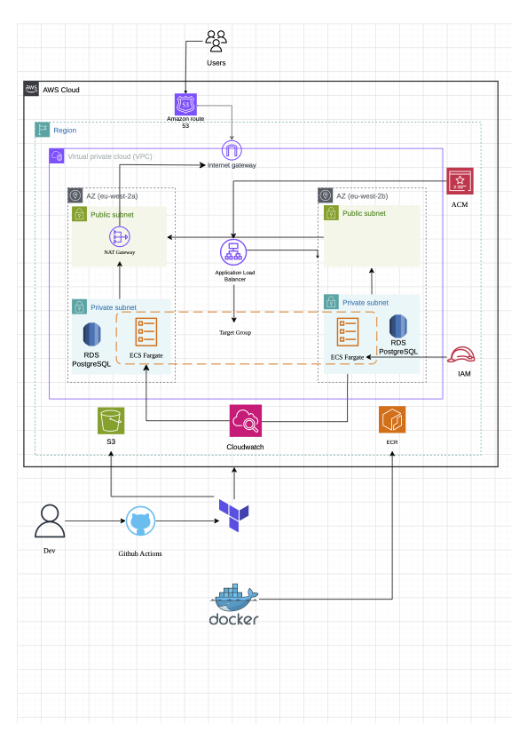
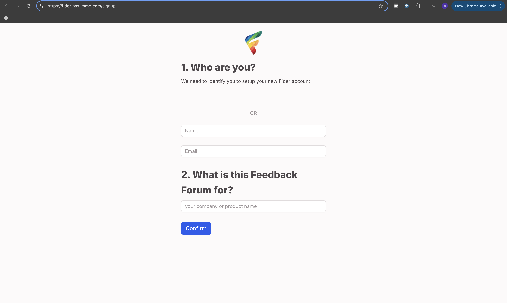
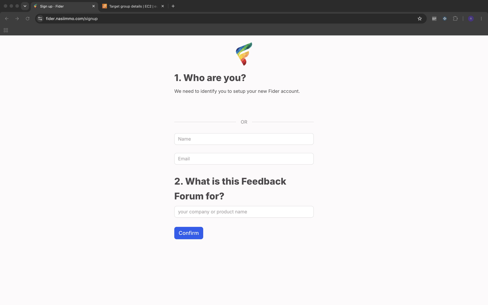
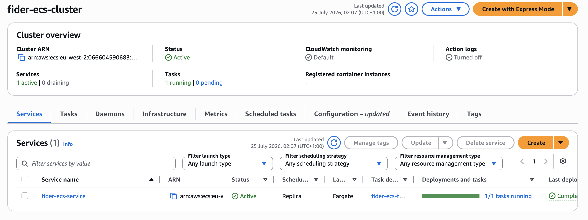
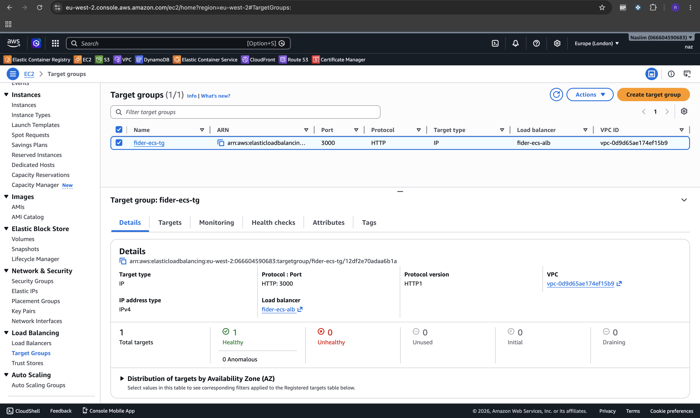
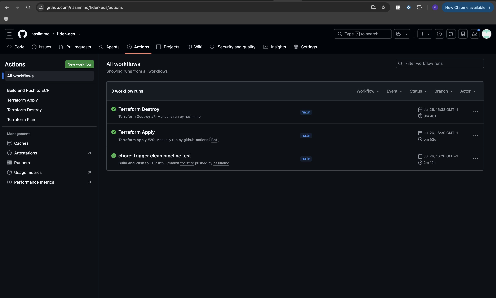
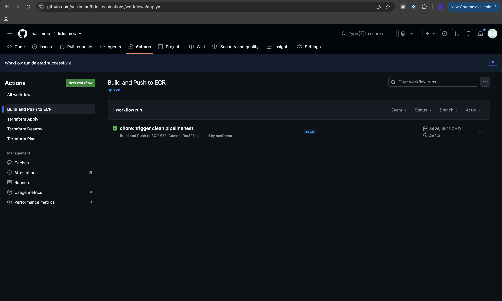
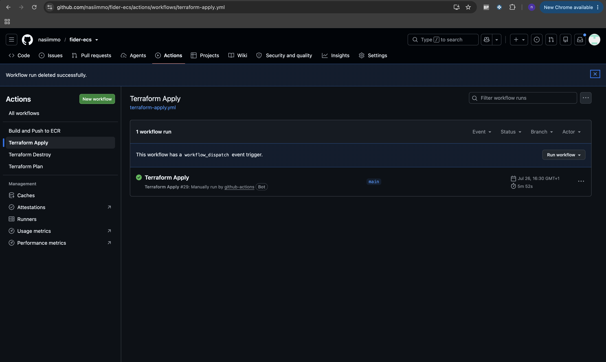
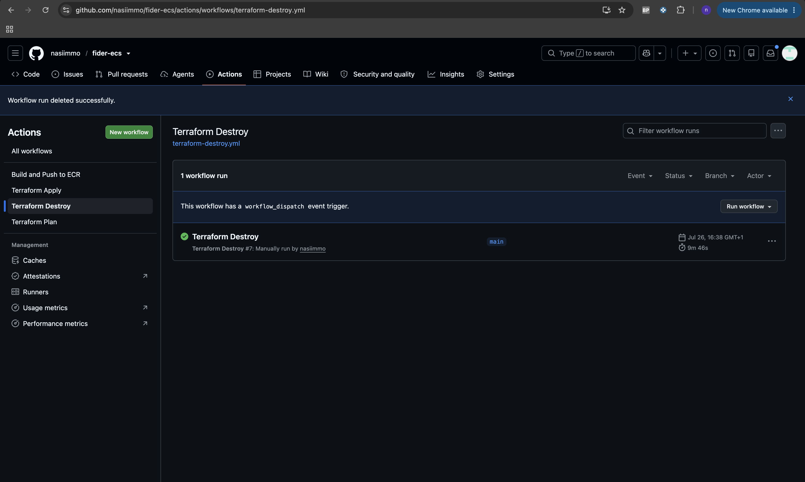

# fider-ecs

Production deployment of [Fider](https://getfider.com/) on AWS ECS Fargate using Docker, Terraform, and GitHub Actions.

## Table of Contents

- [Overview](#overview)
- [Architecture](#architecture)
- [App Demo](#app-demo)
- [Local Setup](#local-setup)
- [Project Structure](#project-structure)
- [Terraform State](#terraform-state)
- [CI/CD Pipelines](#cicd-pipelines)
- [GitHub Actions Secrets](#github-actions-secrets)
- [Cost Estimate](#cost-estimate)
- [Technologies](#technologies)

---

## Overview

This project deploys Fider, an open-source customer feedback platform, on AWS. The project follows a structured approach: run locally, containerise, deploy manually via the AWS console, rebuild everything as Terraform code, then automate with CI/CD pipelines.

- App: Fider (Go + React + PostgreSQL)
- Containerisation: Docker multi-stage build (337MB image)
- Infrastructure: Terraform with modular architecture
- Orchestration: ECS Fargate
- Database: RDS PostgreSQL 17
- Load Balancing: ALB with HTTPS via ACM
- DNS: Cloudflare with automated CNAME management
- CI/CD: GitHub Actions (4 pipelines)

---

## Architecture



**Networking:**
- Custom VPC (10.0.0.0/16) across 2 availability zones (eu-west-2a, eu-west-2b)
- 2 public subnets for ALB and NAT Gateway
- 2 private subnets for ECS tasks and RDS
- Internet Gateway and NAT Gateway

**Compute:**
- ECS Fargate cluster
- Docker image stored in ECR, tagged with commit SHA
- CloudWatch logging for container output

**Database:**
- RDS PostgreSQL 17 on db.t3.micro
- Private subnets only, not publicly accessible
- Security group allows inbound only from ECS

**Security:**
- Security group chain: ALB -> ECS -> RDS
- IAM execution role with least privilege
- No hardcoded secrets, all passed via GitHub secrets and Terraform variables

**DNS and SSL:**
- ACM certificate for `*.nasiimmo.com` with automated DNS validation via Cloudflare
- Cloudflare CNAME record managed by Terraform

---

## App Demo

Application running at `https://fider.nasiimmo.com`









Note: The infrastructure is torn down after each deployment to keep costs low.

---


## Project Structure

```
fider-ecs/
├── app/
├── Dockerfile
├── .dockerignore
├── .gitignore
├── images/
│
├── infra/
│   ├── provider.tf
│   ├── main.tf
│   ├── variables.tf
│   ├── outputs.tf
│   └── modules/
│       ├── vpc/
│       │   ├── main.tf
│       │   ├── variables.tf
│       │   └── outputs.tf
│       ├── acm/
│       │   ├── main.tf
│       │   ├── variables.tf
│       │   └── outputs.tf
│       ├── alb/
│       │   ├── main.tf
│       │   ├── variables.tf
│       │   └── outputs.tf
│       ├── ecs/
│       │   ├── main.tf
│       │   ├── variables.tf
│       │   └── outputs.tf
│       ├── ecr/
│       │   ├── main.tf
│       │   ├── variables.tf
│       │   └── outputs.tf
│       ├── iam/
│       │   ├── main.tf
│       │   ├── variables.tf
│       │   └── outputs.tf
│       └── rds/
│           ├── main.tf
│           ├── variables.tf
│           └── outputs.tf
│
└── .github/
    └── workflows/
        ├── app.yml
        ├── terraform-apply.yml
        ├── terraform-destroy.yml
        └── terraform-plan.yml
```

---

## Local Setup

### Prerequisites

- Go 1.26+
- Node.js v22+
- Docker Desktop

### Running Locally

```bash
git clone https://github.com/nasiimmo/fider-ecs.git
cd fider-ecs/app
```

Start local dependencies:

```bash
docker-compose up -d
```


Run the app:

```bash
make build-server
make build-ui
make migrate
make run
```

Visit `http://localhost:3000`

---

## Terraform State

- Backend: S3 bucket `terraform-state-nasiim` in eu-west-1
- Key: `fider-ecs/terraform.tfstate`
- Locking: S3 native locking with `use_lockfile = true`

---

## CI/CD Pipelines



### Build and Push to ECR

**Trigger:** Push to `main` affecting `app/**`, `Dockerfile`, `.dockerignore`

1. Checkout code
2. Configure AWS credentials
3. Create ECR repository if not exists
4. Login to ECR
5. Build and push Docker image tagged with commit SHA
6. Trigger Terraform Apply with new image tag



### Terraform Apply

**Trigger:** Push to `main` affecting `infra/**`, or triggered by app pipeline

1. Checkout code
2. Configure AWS credentials
3. Terraform init
4. Import ECR repository if already exists
5. Terraform plan
6. Terraform apply



### Terraform Destroy

**Trigger:** Manual only

1. Checkout code
2. Configure AWS credentials
3. Terraform init
4. Targeted destroy, excludes ECR to preserve images



### Terraform Plan

**Trigger:** Pull requests to `main` affecting `infra/**`

1. Terraform fmt check
2. Terraform validate
3. Terraform plan

---

## GitHub Actions Secrets

| Secret | Description |
|--------|-------------|
| `AWS_ACCESS_KEY_ID` | AWS access key |
| `AWS_SECRET_ACCESS_KEY` | AWS secret key |
| `AWS_REGION` | eu-west-2 |
| `DB_PASSWORD` | RDS master password |
| `DB_USERNAME` | RDS master username |
| `JWT_SECRET` | Fider JWT secret |
| `CLOUDFLARE_API_TOKEN` | Cloudflare API token |
| `CLOUDFLARE_ZONE_ID` | Cloudflare zone ID |
| `TF_VAR_image_tag` | ECR image SHA, updated automatically by pipeline |

---

## Cost Estimate

- NAT Gateway: ~$32/month
- RDS db.t3.micro: ~$15/month
- ALB: ~$6/month
- ECS Fargate: ~$5/month
- ECR: <$1/month
- Total: ~$59/month


Infrastructure is torn down after each deployment so costs only apply while running.

---

## Technologies

- Cloud: AWS (ECS Fargate, RDS, ALB, ACM, ECR, CloudWatch, IAM)
- IaC: Terraform
- Containers: Docker
- CI/CD: GitHub Actions
- DNS: Cloudflare
- Database: PostgreSQL 17
- Application: Fider (Go + React)

---

## Author

Nasiim Nuur - [GitHub](https://github.com/nasiimmo) | [LinkedIn](https://www.linkedin.com/in/nasiim04/)
